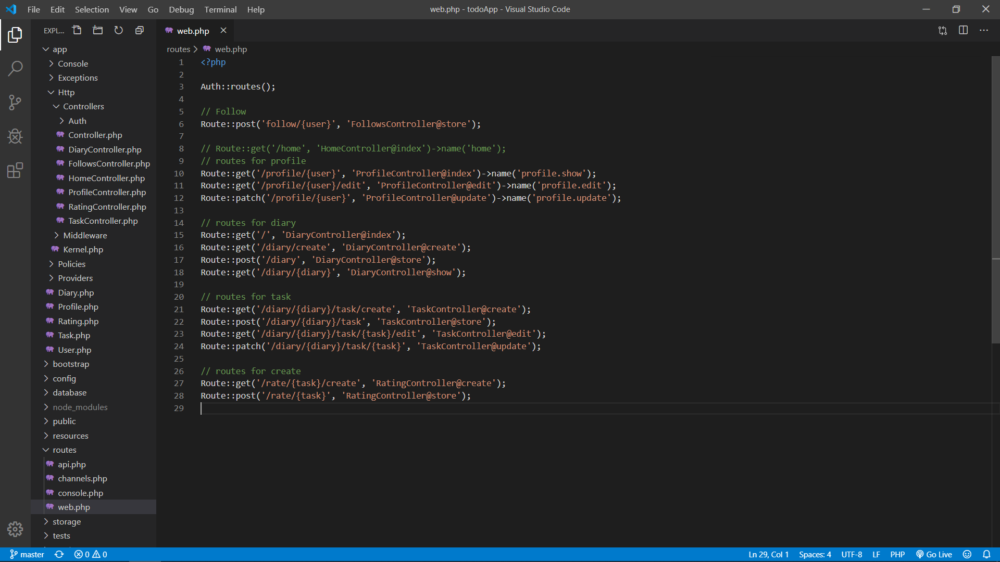
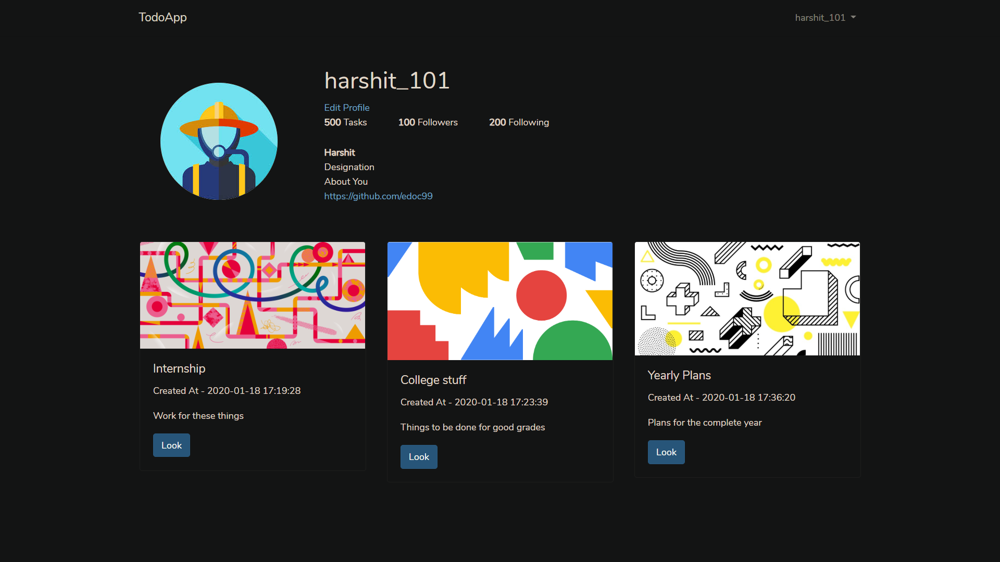
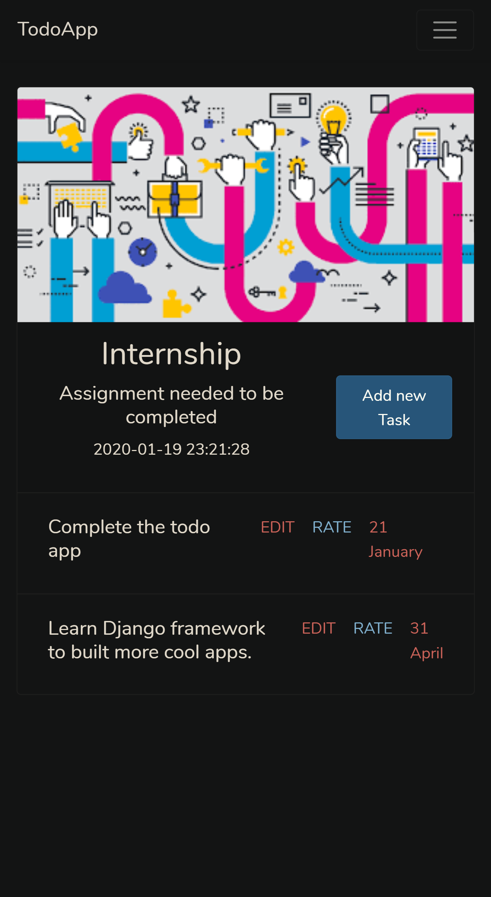

# SociTa

An application helping you to manage and organize your tasks and share them with your friends(followers). 

## Features 

- Categories your task.
- Better visual representation.
- Allow users to know about others tasks.
- Allow others to rate there tasks.

## Some insights
- <h3>Routes</h3>
   
  
- <h3>Relationship between tables</h3>
  

- <h3>Some screenshots</h3>
  
  
